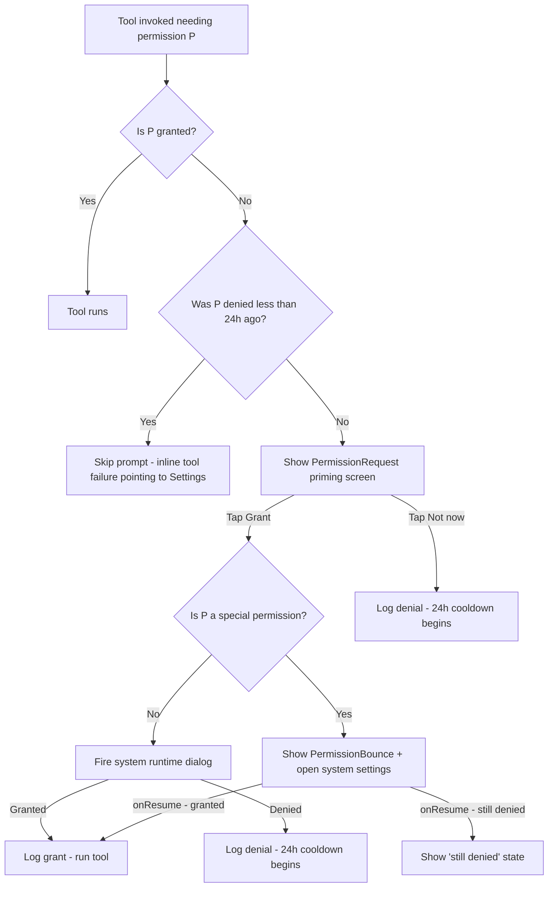

# Mitra Permission Grant Choreography

The product principle: **ask lazily, explain plainly, never beg, never re-prompt within 24h.** Every permission below has a single, predictable flow. The choreography is identical in structure across permissions — only the copy and the system handoff vary.

**Audit invariant**: every permission grant, revoke, or denial writes an entry to AuditLog with shape `(permissionName, action, timestampMs)`. No reason text, no user identifiers. The audit log itself never re-prompts.

**Cooldown invariant**: after a permission is denied, Mitra does not re-show the priming screen for 24 hours, even if the user re-invokes the same tool. The tool failure copy in that window points to Settings → Permissions, where the user can manually re-enable.

**Persistence invariant** (per action-cards.md): the "Don't ask again 5 min" suppression on action confirmations is session-only, in-memory. Permission cooldowns, by contrast, persist to DataStore (just the deny timestamp per permission — no decision content).

---

## 1. The universal flow

Every permission Mitra requests follows the same six-step choreography:



Five state transitions to handle correctly:
1. **never_asked → priming → runtime/bounce → granted | denied**
2. **denied → cooldown → ask_again_after_24h**
3. **granted → revoked_in_system_settings → re-detected on resume → cooldown**
4. **granted → revoked → tool runs → tool fails fast with permission-revoked failure class**
5. **hard_denied_via_system ("Don't ask again") → priming shows "Open settings" CTA → PermissionBounce → ACTION_APPLICATION_DETAILS_SETTINGS**

---

## 2. Permission inventory

| Permission | Special? | Tools depending on it | Eager / Lazy | Milestone |
|---|---|---|---|---|
| `WRITE_SETTINGS` | Yes (system settings page) | Brightness tools | Lazy | M1 |
| `ACCESS_NOTIFICATION_POLICY` | Yes (DND access page) | DND on/off, ringer modes | Lazy | M1 |
| `RECORD_AUDIO` | No (runtime) | Voice input | Lazy | M4 |
| `READ_PHONE_STATE` | No (runtime) | Telephony state checks, call routing | Lazy | M1 |
| `CALL_PHONE` | No (runtime) | Place call | Lazy | M1 |
| `SEND_SMS` | No (runtime) | Send SMS | Lazy | M1 |
| `READ_CONTACTS` | No (runtime) | Name → number resolution | Lazy | M1 |
| `BIND_NOTIFICATION_LISTENER_SERVICE` | Yes (Notification access page) | Read incoming messages, RemoteInput reply | Lazy | M1 |
| `BIND_ACCESSIBILITY_SERVICE` | Yes (Accessibility page) | App control / screen automation | Lazy | M6 / V2 |

> `POST_NOTIFICATIONS` (API 33+) is not in this list because Mitra does not show user-facing notifications in V1. The foreground service that hosts the model runtime uses a minimum-importance ongoing notification (`NotificationCompat.PRIORITY_MIN`) that does not require POST_NOTIFICATIONS to display, only to surface in the status bar — graceful degradation if denied.

> No eager permission requests in V1. Every permission is lazy. The Welcome / PrivacyPromise / ModelDownload / LoadingModel / Capabilities / Chat sequence does not surface a single permission prompt.

---

## 3. Per-permission specs

Each section: **why-needed copy** (the priming screen body), **runtime path**, **special-permission bounce flow** (if applicable), **denied-state UX**, **revoked-state UX**.

---

### 3.1 WRITE_SETTINGS

**Tools depending on it**: `brightness_set`, `brightness_auto`.

**Why-needed copy** (PermissionRequest, 2 sentences):

> To set brightness, Mitra needs a one-time system permission. This is the same permission Android shows for apps that change display settings.

**Runtime path**: Not a runtime permission. There is no system dialog. Direct PermissionBounce.

**Bounce flow** (PermissionBounce → `Settings.ACTION_MANAGE_WRITE_SETTINGS`, with `data = Uri.parse("package:com.mitra")`):

Screen narrative:
- Pre-bounce: "Android opens the 'Modify system settings' page next. Toggle the switch next to Mitra, then come back."
- A 3-step illustration:  `[ Settings page → Find Mitra → Toggle on ]`
- Primary CTA: `Open settings`
- Secondary: `Not now`

On resume detection (PermissionBounce lifecycle observer):
```kotlin
Settings.System.canWrite(context) // re-checked onResume
```
- If true → grant logged, tool runs, brief "Done." toast.
- If false after a return → `still_denied` state: "Permission still off. Try again?" with Retry + Skip.

**Denied state**: same as the universal cooldown. 24h hold. Tool failure copy: "Cannot change brightness without system permission. Re-enable in Settings → Permissions."

**Revoked state**: detected on next tool invocation; tool fails with `PermissionRevoked` failure class and the failed-state card offers "Open settings".

---

### 3.2 ACCESS_NOTIFICATION_POLICY (DND access)

**Tools depending on it**: `dnd_on`, `dnd_off`, `ringer_silent`, `ringer_vibrate`, `ringer_normal`.

**Why-needed copy**:

> To turn Do Not Disturb on or off, Mitra needs a one-time access permission for the notification policy. It is set in Android's "Do Not Disturb access" page.

**Runtime path**: Not a runtime permission. Direct PermissionBounce.

**Bounce target**: `Settings.ACTION_NOTIFICATION_POLICY_ACCESS_SETTINGS`.

**Bounce flow** (screen narrative):
- Pre-bounce: "Android opens the 'Do Not Disturb access' page. Find Mitra in the list and toggle it on."
- 3-step illustration: `[ DND access list → Find Mitra → Toggle on ]`
- Primary CTA: `Open settings`

On resume detection:
```kotlin
notificationManager.isNotificationPolicyAccessGranted // re-checked onResume
```

**Denied state**: 24h hold; tool failure copy: "Cannot change Do Not Disturb without this access. Re-enable in Settings → Permissions."

**Revoked state**: same handling as WRITE_SETTINGS — fail fast with `PermissionRevoked`, offer settings bounce.

---

### 3.3 RECORD_AUDIO

**Tools depending on it**: voice input (M4).

**Why-needed copy**:

> To listen to your voice commands, Mitra needs Microphone access. Audio is processed on this device — nothing is recorded or sent anywhere.

**Runtime path**: Standard runtime permission. `ActivityResultContracts.RequestPermission()` after priming.

**Bounce flow**: N/A — runtime only. If the user hard-denies twice, Android automatically promotes to "Don't ask again" — detection happens via `shouldShowRequestPermissionRationale()`. When that returns false **and** the permission is denied, we know it is hard-denied and the priming screen's CTA becomes "Open settings" (Mitra's app details page).

**Denied state**: 24h hold; voice input button is visibly inert with a small lock glyph; tap on it within the cooldown shows a brief inline note ("Microphone access denied. Re-enable in Settings → Permissions.") instead of re-prompting.

**Revoked state**: voice input becomes inert on next launch; the inline lock glyph reappears.

**Milestone gate**: this entire section is dormant until M4 ships. The microphone UI button is in the Chat input bar but inert in V1 (M1-M3).

---

### 3.4 READ_PHONE_STATE

**Tools depending on it**: `call_status`, internal routing for `call_contact` / `call_number`.

**Why-needed copy**:

> To make calls reliably, Mitra needs to check whether the phone is already on a call. This permission lets Mitra see the call state — never the call content.

**Runtime path**: Standard runtime permission. Often co-requested with `CALL_PHONE` since the use case is the same (placing a call).

**Co-request rule**: when a tool needs both `READ_PHONE_STATE` and `CALL_PHONE`, surface a single combined priming screen titled "Phone access" with both permissions listed in the body. Trigger the runtime dialogs **sequentially** (not simultaneously) — Android allows multi-permission requests, but the visual UX of two stacked dialogs violates the "never stack prompts" principle in onboarding.md.

**Denied state**: 24h cooldown applies to both permissions independently. Tool failure: "Cannot place call without Phone access. Re-enable in Settings → Permissions."

**Revoked state**: tool fails on next invocation; recovery affordance opens settings.

---

### 3.5 CALL_PHONE

**Tools depending on it**: `call_contact`, `call_number`.

**Why-needed copy** (combined screen when co-requested with READ_PHONE_STATE):

> To place a call, Mitra needs Phone access. Mitra uses your default Phone app to dial — it never records calls.

**Runtime path**: Standard runtime permission, requested after READ_PHONE_STATE in the co-request flow.

**Confirmation interplay**: every `call_contact` / `call_number` tool invocation is `SideEffect.Irreversible` (per action-cards.md), so even with the permission granted, the call requires a ConfirmationModal before dialling. Permission ≠ pre-approval.

**Denied / revoked**: as per universal flow.

---

### 3.6 SEND_SMS

**Tools depending on it**: `send_sms`.

**Why-needed copy**:

> To send the message, Mitra needs SMS access. Mitra uses your default messaging app to send — it never reads your existing messages.

**Runtime path**: Standard runtime permission.

**Confirmation interplay**: every `send_sms` invocation is Irreversible — ConfirmationModal shows the recipient and message body before sending. The "Don't ask again 5 min" suppression is opt-in per (recipient, message) pair (see action-cards.md §5).

**Denied state**: tool fails inline; copy is the standard "Cannot send without SMS access. Re-enable in Settings → Permissions."

**Revoked state**: standard handling.

> Carrier-cost note shown in the body copy of every SMS ConfirmationModal: "This sends an SMS. SMS counts toward your carrier plan." This is content on the modal, not the priming screen.

---

### 3.7 READ_CONTACTS

**Tools depending on it**: `resolve_contact` (used internally by `call_contact`, `send_sms` to map "Priya" → +91 ...).

**Why-needed copy**:

> To call or message someone by name, Mitra needs to read your Contacts. Contacts stay on this device — Mitra never copies or syncs them.

**Runtime path**: Standard runtime permission. Requested lazily the first time a tool needs to resolve a name.

**Denied state**: degraded mode — tools that need contact resolution prompt the user inline for a number ("Mitra cannot read your contacts. Kindly type Priya's number.") rather than failing outright. 24h cooldown applies to the priming.

**Revoked state**: same as denied — fall back to manual number entry.

---

### 3.8 BIND_NOTIFICATION_LISTENER_SERVICE

**Tools depending on it**: `read_recent_notifications`, `reply_to_notification`, `dismiss_notification`.

**Why-needed copy** (longer than runtime permissions — this is a trust moment):

> To read and reply to your notifications, Mitra needs Notification access. This is a special Android permission — Mitra only reads notifications when you ask, never in the background, and every read is logged in your audit log.

**Runtime path**: Not a runtime permission. Bounce to `Settings.ACTION_NOTIFICATION_LISTENER_SETTINGS`.

**Bounce flow**:
- Pre-bounce: "Android opens the 'Notification access' page. Find Mitra in the list and toggle it on. You'll see a system warning — that warning is standard for any app with this permission."
- 4-step illustration: `[ Notification access list → Find Mitra → Toggle on → Allow on system dialog ]`
- Primary CTA: `Open settings`
- Persistent caption: "Mitra logs every read in your audit log. Open the audit log."

On resume detection:
```kotlin
NotificationManagerCompat.getEnabledListenerPackages(context).contains("com.mitra")
```

**Denied state**: 24h hold; the notification-reading tools fail with "Cannot read notifications without access. Re-enable in Settings → Permissions."

**Revoked state**: detected on next tool invocation; tools fail fast; the audit-log UI surfaces a one-time inline banner ("Notification access was revoked. Some tools will not work until re-enabled.").

---

### 3.9 BIND_ACCESSIBILITY_SERVICE (V2, M6)

**Tools depending on it**: app-control tools, screen-context queries beyond what the Notification Listener can provide.

**Why-needed copy** (the hardest priming screen Mitra will ever ship):

> To control other apps on your behalf, Mitra needs Accessibility Service permission. This is the same permission used by screen readers and password managers — it grants deep access to what's on your screen and the ability to tap and type for you.
>
> Mitra uses it only when you ask, never in the background, and every use is logged in your audit log. Because Mitra is open source, you can read exactly how this permission is used: \[link to GitHub source\].

**Runtime path**: Not a runtime permission. Bounce to `Settings.ACTION_ACCESSIBILITY_SETTINGS`.

**Bounce flow** (the most hand-held bounce in the app):
- Pre-bounce: Two-screen flow — first an explainer screen (above copy), then a confirm screen ("Tap 'Open settings' to continue").
- 4-step illustration on the bounce screen itself: `[ Accessibility page → Installed apps → Mitra → Toggle on → Confirm dialog ]`
- A small "Why open source matters here" link inline.
- Primary CTA: `Open settings`
- Secondary: `Not now` (very visible — the user MUST be able to skip without feeling pressured)

**Denied state**: app remains fully functional without it. Feature gating: tools requiring accessibility show a small lock icon in the chat suggestion chips with a tooltip ("Needs Accessibility Service — tap to set up"). Not a 24h hold for this permission — the user can choose to set it up anytime they want, but Mitra never proactively re-prompts.

**Revoked state**: tools fail with `PermissionRevoked`; recovery affordance offers settings bounce.

**Milestone gate**: dormant in V1. This section exists so the V1 codebase can declare the manifest entry and the priming copy without surfacing the flow yet.

---

## 4. Settings → Permissions surface

The Settings screen (per screens.md) lists permissions as rows. Each row:

```
[icon]  Phone access                                  Granted
        Used for: call, call_status                   [Manage]
```

| Row state | Right-aligned label | Tap behaviour |
|---|---|---|
| `granted` | `Granted` (in `success` colour) | Opens the system app-details page where the user can revoke. No in-app revoke — Android owns revocation. |
| `denied` (within 24h) | `Not now · 23h left` | Disabled; copy "Available to re-enable in 23 hours, or tap below to re-prompt immediately." with a small "Re-enable now" button. |
| `denied` (after 24h) | `Off` | Opens PermissionRequest (priming) again — the lazy flow resumes. |
| `hard_denied` | `Off — system blocked` | Opens PermissionBounce to `ACTION_APPLICATION_DETAILS_SETTINGS`. |
| `special_off` | `Off` | Opens PermissionBounce directly. |

The Settings list shows the user-friendly name ("Phone access", "SMS access", "Microphone", "Brightness control", "Do Not Disturb control", "Contacts", "Notification access", "Accessibility Service") not the raw Android constant. A `PermissionDisplay.kt` lookup owns this mapping.

---

## 5. Re-enable affordances

Per the brief: "Settings has a manual 'Re-enable \[X\]' toggle that fires the system grant intent." Specifically:

- For **runtime permissions** within their 24h cooldown: the row is disabled, but a small "Re-enable now" button (under the row, secondary) lets the user override the cooldown. Tapping fires the system permission dialog directly (no priming re-shown — they already saw it).
- For **runtime permissions** past 24h: tapping the row fires the priming → runtime dialog flow as if it were the first ask.
- For **hard-denied permissions**: tapping the row opens `ACTION_APPLICATION_DETAILS_SETTINGS`. The user manually flips the toggle there.
- For **special permissions**: tapping the row always opens PermissionBounce.

The "Re-enable now" override does NOT bypass the audit log — granting via override still writes a `(permission, action=grant, timestampMs)` entry.

---

## 6. The voice tone applied

Every permission string in this document follows the voice.md principles:

- **No begging**: "To set alarms, Mitra needs Clock access. Grant?" — not "Could you please allow us to access your Clock?"
- **No fear**: "Mitra logs every read in your audit log" — not "Don't worry, we don't sell your data."
- **No condescension**: "Toggle the switch next to Mitra, then come back." — not "Don't worry, it's easy!"
- **Honesty about scope**: every why-needed sentence states what the permission is used for AND what it is not used for. The negative space carries the trust.
- **No exclamation marks anywhere in permission screens.**

---

## 7. Kotlin codification

```kotlin
// ui/permissions/PermissionFlow.kt
package com.mitra.ui.permissions

sealed interface PermissionId {
    val androidName: String
    val isSpecial: Boolean
    val displayName: String           // user-facing name from PermissionDisplay
    val toolsUsedFor: List<String>    // populated by ToolRegistry, surfaced in Settings
}

data object Brightness : PermissionId { ... }
data object Dnd : PermissionId { ... }
data object Microphone : PermissionId { ... }
data object PhoneState : PermissionId { ... }
data object CallPhone : PermissionId { ... }
data object SendSms : PermissionId { ... }
data object ReadContacts : PermissionId { ... }
data object NotificationListener : PermissionId { ... }
data object AccessibilityService : PermissionId { ... }

enum class PermissionStatus {
    Granted,
    NeverAsked,
    Denied,          // within cooldown
    DeniedExpired,   // cooldown lapsed
    HardDenied,      // system "Don't ask again"
    Revoked,         // was granted, now isn't
}

interface PermissionRepository {
    suspend fun status(id: PermissionId): PermissionStatus
    suspend fun recordDenial(id: PermissionId)
    suspend fun recordGrant(id: PermissionId)
    fun observeAll(): Flow<Map<PermissionId, PermissionStatus>>
}
```

One `<Name>PermissionFlow.kt` Composable per permission (or per family — Phone state + Call phone share a file). Each flow Composable accepts the `PermissionRepository`, the requesting tool's name, and returns a callback for grant/deny outcomes.

The cooldown record is a single `Map<PermissionId, Long>` (permission → last-deny timestamp) in DataStore. Nothing else is persisted — no reason text, no count, no decision history beyond the timestamp.

---

## 8. Test invariants

- A test asserts no permission has its priming screen shown twice within 24h for the same tool invocation context.
- A test asserts every tool registered with a `requiredPermissions` list has a corresponding entry in PermissionDisplay.
- A test asserts the audit log entry written on grant / revoke / denial conforms to the field-whitelisted schema and contains no string content beyond the permission name and action enum.
- A test asserts that on cold start, no permission prompt is shown until the user invokes a tool that needs it. (Catches accidental eager requests.)
- A test asserts that the Settings → Permissions row tap opens the correct destination for each PermissionStatus value.
