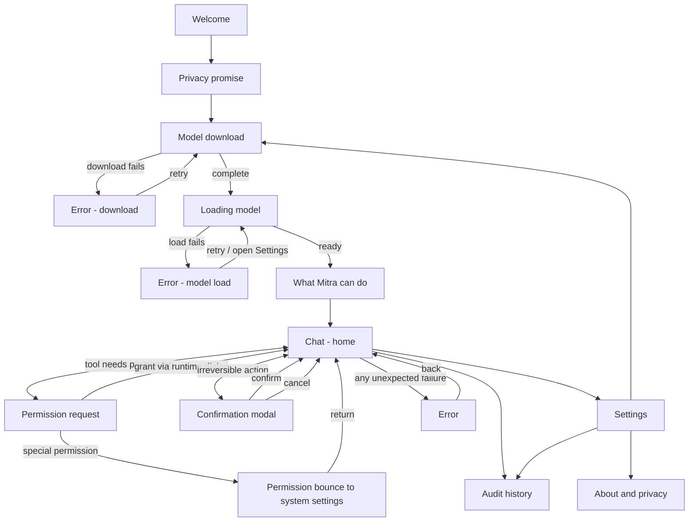

# Mitra Screen Inventory & State Matrix

Every screen Mitra will ever have in V1, every state each can be in, every transition between them. The navigation graph derives from this file.

**Milestones used as gates**:
- M0 — skeleton
- M1 — 25-tool surface
- M2 — ConfirmationGate + audit log
- M3 — eval set + deferred fine-tuning (no UI; CI only)
- M4 — voice input
- M5 — polish
- M6 — accessibility automation (V2 — out of V1 inventory)

**V1 canonical screen list (13)**: Welcome, PrivacyPromise, ModelDownload, LoadingModel, Capabilities, Chat, ConfirmationModal, PermissionRequest, PermissionBounce, AuditHistory, Settings, AboutPrivacy, Error.

ActionCard inline variants (Silent / Toast / Modal) live within Chat — they are components, not screens.

---

## Master flow (Mermaid)



The four entry points to V1 are: app first-launch (→ Welcome), app cold start when onboarded (→ Chat), launcher widget tap (→ Chat with prefilled prompt), notification action tap (→ ConfirmationModal directly).

---

## Screen-by-screen specs

Each section: **purpose**, **entry points**, **exit points**, **states**, **key elements**, **dependencies**, **milestone gate**.

---

### 1. Welcome

- **Purpose**: Set expectations in one screen — Mitra is an on-device, private AI.
- **Entry**: First launch only (gated by a `first_run_complete` flag in DataStore).
- **Exit**: Tap "Get started" → PrivacyPromise.
- **States**:
  - `default` — only state. No async work, no failure mode.
- **Key elements**: App wordmark, headline ("Welcome to Mitra."), one-line subhead, single primary CTA, subtle "Read the source →" link to GitHub.
- **Dependencies**: none.
- **Milestone**: M0.

---

### 2. PrivacyPromise

- **Purpose**: Pre-empt the "is this sending my data to Google" question before any download.
- **Entry**: Welcome.
- **Exit**: ModelDownload.
- **States**:
  - `default`
- **Key elements**: Headline ("Nothing leaves your phone."), 3-line body, small visual diagram (phone outline, no cloud arrow), primary CTA, "Learn more" link to in-app docs.
- **Dependencies**: none.
- **Milestone**: M0.

---

### 3. ModelDownload

- **Purpose**: Pull Gemma 4 E2B (~2.59 GB) onto the device.
- **Entry**: PrivacyPromise (first run); Settings → "Manage model" (later changes).
- **Exit**:
  - On success → LoadingModel (if from onboarding) or Settings (if from later).
  - On user cancel → back to caller (no exit if onboarding — cancel is disabled until 5% downloaded).
- **States**:
  - `idle` — model not yet downloaded; shows model card with size + "Download" CTA.
  - `preflight_check` — checking free storage & Wi-Fi availability.
  - `insufficient_storage` — modal-style explainer with required vs available; CTA to open Storage settings.
  - `no_wifi_warning` — toast-style "Wi-Fi recommended for 2.59 GB. Download on mobile data anyway?" with explicit confirmation.
  - `downloading` — progress bar (determinate, % + MB), pause / cancel actions, "what you can do while waiting" hint after 30s.
  - `paused` — same bar, "Resume" CTA, reason caption ("Paused — no Wi-Fi" / "Paused — by you").
  - `network_lost` — auto-transitions to paused with reason caption.
  - `verifying` — post-download hash check; usually <2 seconds, indeterminate spinner.
  - `verify_failed` — hash mismatch; suggests retry; deletes corrupt file.
  - `complete` — checkmark + size on disk; CTA "Continue" (onboarding) or "Done" (Settings).
  - `download_failed` — error code + retry; classified causes (network, disk full, server, hash).
- **Key elements**: Model card (name, size, source attribution "An open model from Google · Apache 2.0"), Wi-Fi-only toggle (default ON), Background download toggle (default ON), progress bar with byte counter, ETA, pause/cancel buttons, "what you can do while waiting" hint.
- **Dependencies**: Network. Storage. WorkManager (foreground service for download). DataStore for resume state.
- **Milestone**: M0.

---

### 4. LoadingModel

- **Purpose**: Wire up the LiteRT-LM runtime, load weights into memory.
- **Entry**: ModelDownload `complete` (onboarding); cold start (returning user, before reaching Chat); Settings → "Reload model".
- **Exit**:
  - On ready → Capabilities (onboarding); Chat (returning user).
  - On failure → Error (model load).
- **States**:
  - `initializing` — runtime starting; indeterminate dot animation; subtitle "Loading model — about 3 seconds."
  - `loading_weights` — same UI, subtitle "Almost there."
  - `ready` — transitions out, no UI of its own.
  - `failed` — short failure message ("Model could not load.") + Retry CTA + "Open Settings" secondary; transitions to Error after one failed retry.
- **Key elements**: Mitra wordmark (centred), single subtle dot-pulse animation, one-line status text. Cancel button only appears after 8 seconds (escape hatch for stuck loads).
- **Dependencies**: LiteRT-LM Kotlin runtime; model file present on disk.
- **Milestone**: M0.

---

### 5. Capabilities

- **Purpose**: Calibrate expectations before first chat (R-006 — heads off misuse). Tell the user what Mitra can and cannot do.
- **Entry**: LoadingModel `ready` (first run only). Never shown again after first onboarding completes.
- **Exit**: Chat.
- **States**:
  - `default`
- **Key elements**: Two-column or stacked layout: "What Mitra can do" (4-5 examples with icons — flashlight, alarm, volume, message) and "What Mitra cannot do (yet)" (3 lines — WhatsApp, app control, voice input). Primary CTA: "All good — let's begin."
- **Dependencies**: none.
- **Milestone**: M0.

---

### 6. Chat

- **Purpose**: The home. Where the user types/says things and sees Mitra act.
- **Entry**: LoadingModel `ready` (onboarding); cold start (returning); launcher widget; foreground notification tap; any settings exit.
- **Exit**: AuditHistory, Settings, PermissionRequest, ConfirmationModal, Error.
- **States**:
  - `empty` — no messages yet. Shows: suggestion chips (6 rotating), inline hint "Try saying: 'Turn on flashlight'". Mic button visible but inert (M4 lights it up).
  - `idle` — has prior messages; cursor in input.
  - `composing` — user typing; send button activates at ≥1 char.
  - `model_thinking` — input locked; subtle "Mitra is thinking…" inline indicator under last user message; cancel affordance.
  - `tool_executing` — ActionCard (Silent / Toast / Modal — see action-cards.md) is the live element; rest of chat is read-only.
  - `awaiting_permission` — ActionCard shows `permission_needed` substate; chat is read-only until resolution.
  - `awaiting_confirmation` — ConfirmationModal is over the chat; chat is dimmed.
  - `error` — inline error bubble in chat stream; input remains usable.
- **Key elements**: Message list (user right / Mitra left), input bar (text field + mic placeholder + send), top app bar (audit icon + settings icon, no title — the absence is intentional Linear-style).
- **Dependencies**: Model loaded. ToolRegistry. PermissionState. AuditLog.
- **Milestone**: M1 (input + 25 tools). M2 adds awaiting_confirmation. M4 lights mic.

---

### 7. ConfirmationModal

- **Purpose**: The ConfirmationGate (R-006). Final stop before an irreversible action runs.
- **Entry**: Chat, when the LLM emits a tool call with `SideEffect.Irreversible`.
- **Exit**: Chat (confirmed → run; cancelled → no-op; both logged in audit).
- **States**:
  - `confirm` — initial; "Confirm: \[action\]?" with primary Confirm + secondary Cancel buttons. Brief description of side effect.
  - `running` — primary becomes spinner; both buttons disabled. Modal cannot be dismissed by tap-outside during this state.
  - `done` — success ribbon; modal auto-dismisses after 1.2 sec with hapticConfirm.
  - `failed` — failure description + Try again / Cancel.
- **Key elements**: Headline (the confirm question), single body line describing effect, two buttons (Confirm primary in `danger` colour for delete-class actions, in `primary` clay for send-class actions; Cancel always secondary).
- **Dependencies**: ToolRegistry classification of `SideEffect`. AuditLog write.
- **Milestone**: M2.

---

### 8. PermissionRequest

- **Purpose**: Primed in-app explainer before the runtime permission dialog fires.
- **Entry**: Chat (lazy — tool execution needs a missing permission).
- **Exit**: Chat (on grant or deny — system dialog handles the actual yes/no); PermissionBounce (if special permission).
- **States**:
  - `priming` — explainer copy + "Grant access" primary + "Not now" secondary.
  - `dialog_open` — overlay dimmed, system dialog visible; this state is virtual (we don't draw anything new — the OS dialog covers).
  - `granted` — transitions out; haptic confirm; returns to Chat.
  - `denied_once` — back to priming with adjusted copy ("Mitra cannot \[do thing\] without access. Grant?"). Only shows once per 24h.
  - `denied_twice` — same screen but copy nudges to "Open settings" since the system has likely hard-denied; CTA shifts to PermissionBounce.
- **Key elements**: Permission icon (large), headline ("To \[action\], Mitra needs \[permission\] access."), two-sentence why-needed copy, primary CTA, secondary CTA, persistent "Learn more" link to AboutPrivacy.
- **Dependencies**: PermissionState; the requesting tool's metadata (which permission, which microcopy).
- **Milestone**: M1.

---

### 9. PermissionBounce

- **Purpose**: Generic handler for special permissions that need a system-settings handoff (WRITE_SETTINGS, NotificationListener, ACCESSIBILITY).
- **Entry**: PermissionRequest (when target is a special permission); Settings → "Manage permissions" → "Re-enable X" (when system has hard-denied).
- **Exit**: Returns to caller on resume (we detect grant on `onResume`); manual back returns to caller.
- **States**:
  - `pre_bounce` — overlay explaining the next step ("Tap the toggle next to 'Mitra' on the next screen.") with primary CTA "Open settings".
  - `awaiting_return` — informational waiting state shown after the user returns from system settings; resolves automatically based on permission state.
  - `granted` — transitions out.
  - `still_denied` — copy adjusts to "Permission still off. Try again?" with retry CTA and "Skip this feature" secondary.
- **Key elements**: Step-by-step illustration (3-step ASCII or icon strip — "Settings → Mitra → Toggle on"), primary CTA, brief reassurance ("Mitra returns here automatically after you grant").
- **Dependencies**: System Settings intent for the specific permission; lifecycle observer to detect return.
- **Milestone**: M1 for WRITE_SETTINGS / NotificationListener; ACCESSIBILITY arrives in V2 (M6).

---

### 10. AuditHistory

- **Purpose**: Show the user exactly what Mitra has done. The trust mechanism. Read-only.
- **Entry**: Chat top bar icon; Settings → "Audit log"; deep link from any permission screen's "Learn more".
- **Exit**: back to caller.
- **States**:
  - `empty` — "Nothing to log yet. Every action Mitra takes will appear here."
  - `loaded` — reverse-chronological list of entries. Two entry types: tool events (toolName, sideEffect, ok, timestampMs) and permission events (permissionName, action grant/revoke/denied, timestampMs). No chat content. Schema-enforced.
  - `filtered` — when a chip filter is active ("Today", "Permissions only", "Failures only").
  - `exporting` — generating an export file; progress.
  - `cleared_confirm` — confirmation modal for "Clear history" (irreversible).
- **Key elements**: Filter chips (Today, This week, Permissions, Failures), entry rows (icon + tool/permission name + 1-line detail + timestamp), Export button, Clear button (in overflow menu, with confirmation).
- **Dependencies**: AuditLog repository; the field-whitelist guard test that prevents schema drift.
- **Milestone**: M2.

---

### 11. Settings

- **Purpose**: Single place for everything configurable. Plain list, no tabs.
- **Entry**: Chat top bar icon.
- **Exit**: Chat; AboutPrivacy; AuditHistory; ModelDownload.
- **States**:
  - `default` — list of sections (see Key elements).
  - `searching` — search bar filters the list.
  - `search_empty` — "No match. Kindly try a shorter word."
- **Key elements**: Sections — **Model** (current model card, change/reload), **Permissions** (per-permission row with current state + Re-enable affordance), **Audit log** (view + export + clear), **Appearance** (theme: System/Light/Dark; haptics on/off), **About & privacy** (link). No accounts. No sign-in. No telemetry toggle (because there is none).
- **Dependencies**: PermissionState; AuditLog metadata for counts; ModelManager.
- **Milestone**: M1.

---

### 12. AboutPrivacy

- **Purpose**: The trust receipts. What Mitra does, what it doesn't, what the user can audit, where the source lives.
- **Entry**: Settings → "About & privacy"; PermissionRequest → "Learn more"; Welcome → "Read the source" (deep link to the GitHub section).
- **Exit**: back to Settings.
- **States**:
  - `default`
- **Key elements**: Two sections in one scroll: **About** (version, build, model name + version + size, runtime, licence) and **Privacy** (the privacy promise restated; data-handling bullet list; "Open source on GitHub" link; licence link; "What we never collect" list). No legal jargon — plain English, same voice as everywhere else.
- **Dependencies**: BuildConfig; Gemma model metadata.
- **Milestone**: M0 (stub) → M1 (full content).

---

### 13. Error

- **Purpose**: Last-resort screen for unhandled failures. Most errors should be inline in Chat or in a specific screen's `failed` substate — Error is only for catastrophes (LiteRT crashes that kill the runtime, DataStore corruption, etc.).
- **Entry**: any screen on unrecoverable failure.
- **Exit**: Chat (with a fresh runtime); app exit if even Chat cannot mount.
- **States**:
  - `model_runtime_lost` — "Mitra had to restart its model. Your chat is preserved." + Restart Mitra CTA.
  - `data_corruption` — "Settings could not load. Reset Mitra to recover?" — destructive recovery requires a typed confirmation.
  - `unknown` — "Something went wrong. Restart Mitra?" — only when no classified cause is available.
- **Key elements**: Brief plain-English description, primary recovery CTA, secondary "Report bug" (opens GitHub issue with prefilled stack trace, no PII).
- **Dependencies**: A top-level error-boundary Composable that catches Compose-tree failures and a global UncaughtExceptionHandler that gates entry to this screen.
- **Milestone**: M0 (stub) → M5 (polish).

---

## State combinatorics — the cases that bite

These are the cross-screen / cross-state combinations that get missed if the matrix isn't explicit. Each one needs an explicit test.

| Combination | Resolution |
|---|---|
| `ModelDownload.paused` while user navigates to Settings | Download continues in WorkManager; on return to ModelDownload, state is rehydrated from WorkManager. |
| `Chat.awaiting_permission` and user backgrounds the app | On resume, re-check permission. If granted, advance the pending tool. If denied, drop the tool and surface a brief inline note. |
| `Chat.tool_executing` and the user sends another message | Send button disabled until tool finishes. User's draft is preserved in the input field. |
| `ConfirmationModal.running` and the user rotates the device | Modal state survives rotation via SavedStateHandle. The running tool is bound to its ViewModel, not to the modal. |
| `PermissionBounce.awaiting_return` and the user kills the app | On next launch, we land on Chat; permission state is re-checked silently. No "ghost" bounce screen. |
| `LoadingModel.failed` then `ModelDownload.idle` (user chose Re-download) | Existing model file deleted, ModelDownload re-runs fresh; no half-loaded state. |
| `AuditHistory.cleared_confirm` and user confirms while a tool is mid-execution | Clear is queued — runs after the current tool's audit entry is written. |

---

## Navigation graph (Kotlin / Compose)

```kotlin
// ui/nav/Routes.kt
sealed class Route(val path: String) {
    data object Welcome : Route("welcome")
    data object PrivacyPromise : Route("privacy_promise")
    data object ModelDownload : Route("model_download")
    data object LoadingModel : Route("loading_model")
    data object Capabilities : Route("capabilities")
    data object Chat : Route("chat")
    data object AuditHistory : Route("audit_history")
    data object Settings : Route("settings")
    data object AboutPrivacy : Route("about_privacy")
    data object Error : Route("error?reason={reason}") {
        fun build(reason: String) = "error?reason=$reason"
    }
}
```

PermissionRequest, PermissionBounce, and ConfirmationModal are **modal sheets / dialogs**, not destinations on the back stack — they are rendered as `ModalBottomSheet` / `Dialog` Composables hosted by Chat's ViewModel. This avoids back-stack pollution and matches user mental model (these things "happen on top of" the chat, they aren't places).

The first-run detector (`first_run_complete` flag in DataStore) sets the start destination at app launch — Welcome if false, Chat if true.

---

## Out of V1 scope (planned, documented for orientation)

- **VoiceTriggerSheet** — M4. Bottom sheet that hosts the voice input UI; replaces the current inert mic button when M4 ships.
- **MacroRecorder** — V2. Records a sequence of tool calls under a name for later replay.
- **Accessibility automation surfaces** — M6. New screens (or rather, overlays) for the bonobo-style screen automation route; not designed here.
